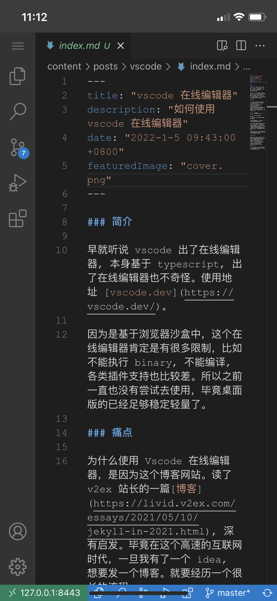

# 简介

早就听说 vscode 出了在线编辑器, 本身基于 typescript, 出了在线编辑器也不奇怪。使用地址 [vscode.dev](https://vscode.dev/)。

因为是基于浏览器沙盒中，这个在线编辑器肯定是有很多限制，比如不能执行 binary, 不能编译, 各类插件支持也比较差。所以之前一直也没有尝试去使用，毕竟桌面版的已经足够稳定轻量了。

# 痛点

为什么使用 Vscode 在线编辑器，是因为这个博客网站。读了 v2ex 站长的一篇[博客](https://livid.v2ex.com/essays/2021/05/10/jekyll-in-2021.html), 深有启发。毕竟在这个高速的互联网时代，一旦我有了一个 idea, 想要发一个博客。就要经历一个很长的流程。

1. 打开一个电脑
2. 创建 Markdown 文件开始书写
3. 使用 git 命令同步到 github
4. 在云服务器上拉取代码，生成静态页面

步骤的繁琐就会阻止我把这个 idea 记录下来的冲动。

当前的互联网产品，比如微博，发布按钮直接在底部菜单栏的正中间，点击后输入简单几个字，点击发布就完成了。再比如抖音，实现用户下沉，直接把文字输入都砍了，直接录制一段视频就可以发布了。

发布的低门槛是这类互联网产品内容大爆炸的直接原因。所以我们要简化博客的发布流程。

# 优化流程

最初我是把第4步，在云服务上拉取代码，生成静态页面这个流程改为使用 Github Action 实现。不得不说，Github Action YYDS!!! 实现参考这个博客的[实现方式](https://github.com/shinoi2/blog/blob/master/.github/workflows/main.yml)

然而 1、2、3 这几个步骤强依赖于电脑，或者说是强依赖于电脑上的 vscode。这时 vscode 网页版就完美的解决了这个问题。

# 部署

Docker YYDS!!! 使用现成的镜像一键部署。参考[这个项目](https://github.com/linuxserver/docker-code-server)

```yaml
---
version: "2.1"
services:
  code-server:
    image: lscr.io/linuxserver/code-server
    container_name: code-server
    environment:
      - PUID=1000
      - PGID=1000
      - TZ=Asia/Shanghai
      - PASSWORD=password #optional
    volumes:
      - /path/to/workspace:/config/workspace
      - /path/to/appdata/config:/config
    ports:
      - 127.0.0.1:8443:8443
    restart: unless-stopped
```
配置 Nginx 反向代理，加上 SSL 证书。

# 最终结果

这是在 iPhone 上的表现，马马虎虎可以使用

